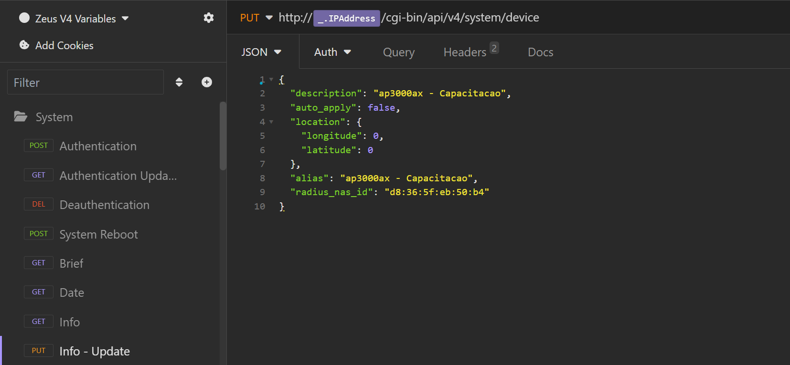
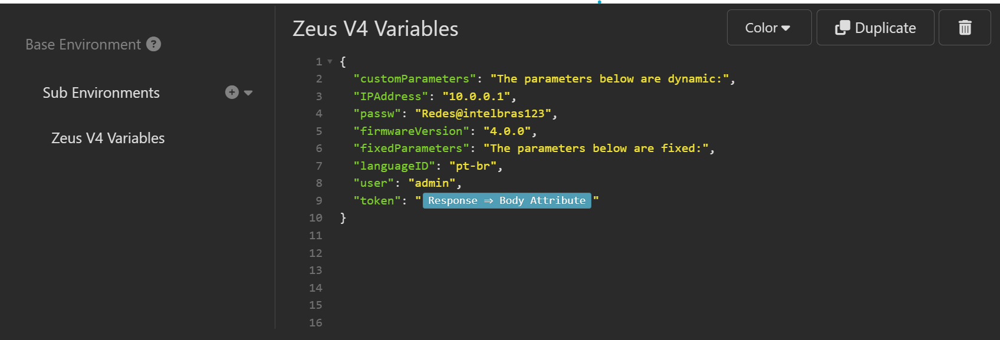

# API collection Repository for Intelbras's devices 

This repository is dedicated to API REST and SOAP collection files and documentations. 


---

## How to Use the Repository:

Browse the NEC Files:
Explore the collection of API files. You'll find files for different products, with diferent configurations and documentations. 

Downloading NEC Files:
To download a API collection file, simply click on the file name you are interested in. On the file's page, click the "Download" button located at the top right. You can also clone the entire repository to your local machine using Git by running the following command in your terminal:

```
git clone https://github.com/arthurcadore/capacita-api
```
---

## Opening API Files in Insomnia (2023.5.8 - Build 07092023):

- Launch your Insomnia software.
- In the menu bar, click on `Collections` section, and click in `import` button located in the top right. 
- Navigate to the location where you downloaded the API file from our repository.
- Select file format as `JSONv4` file, and apply the file importation. 

## Configuring the Environment variables for API collection: 

- In the collection screen, press `Crtl + E` to access the environment configuration section. 

The environment configuration section is displayed below for example: 




- Change the parameters below to your own environment values: 
```
	"IPAddress": IP address for the device that will be configured.
	"passw": HTTP/HTTPs Interface password of the device.  
	"firmwareVersion": Firmware version of the device (only for some endpoints, optional). 
```
